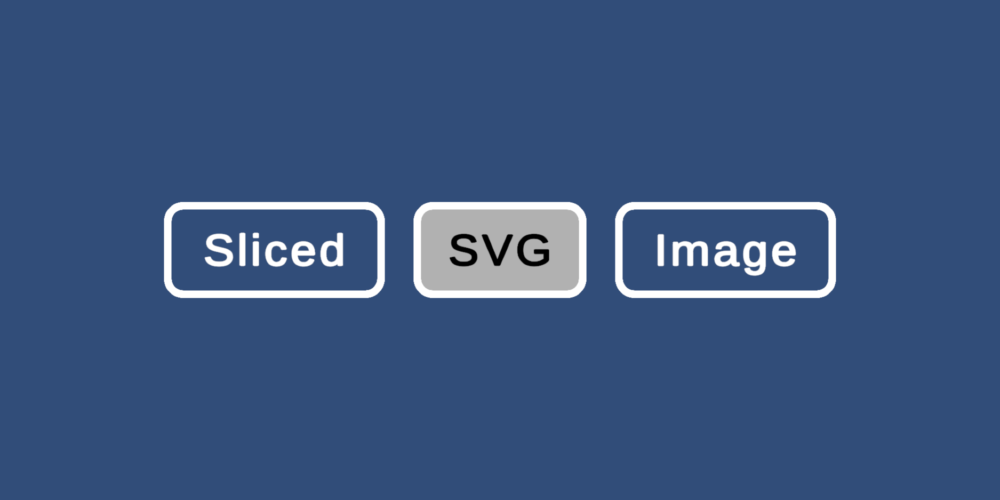

# Unity Sliced SVG Image

> Experimental component for rendering sliced SVG images.

## Install

Add package to your project by using the **Add Package from git URL** option in the **Package Manager**.

```json
{
  "dependencies": {
    "com.scottdoxey.unity-sliced-svg-image": "https://github.com/neogeek/unity-sliced-svg-image.git",
    ...
  }
}
```

## Usage

1. Make sure all SVG files are imported using the **Generated Asset Type** of **Textured Sprite**.
1. Setup your slice based on the pixel dimensions in the app it was created, not based on what you see in the **Sprite Editor**.
1. Swap the **SVG Image** component for the **Sliced SVG Image** component.
1. Add the SVG sprite to the sprite property of the component.

## Notes

1. If the SVG looks blurry when scaled, increase the **Texture Size** property on the imported asset. Default is `256`.
